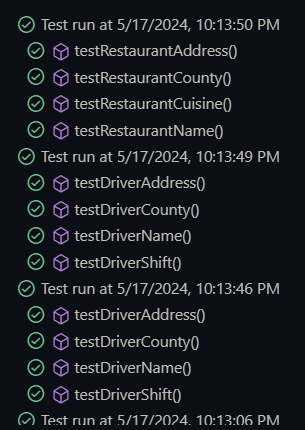

# Online Food Platform, CPPFoodDelivery

### Patterns being used
* Singleton
    
    Singleton is used to create one instance of CPPFoodDelivery which handles the entire app.

* Factory

    An Abstract Factory is uesd to manage the dietery restictions of the customers when creating customer objects.

* Observer

    Implemented so that the restaurant gets notified of all the orders from the customers. 

* Decorator

    Allows the customer to add whatever topping they want to their order.

## JUnit

# OOA & OOD for Netflix Competitor, CPPMovies

## Members & Contributions
* **Ivan Revilla** 
* **Andy Munoz**

It was only us two. Third group member never showed up and had no contributions before the submission of this assignment.